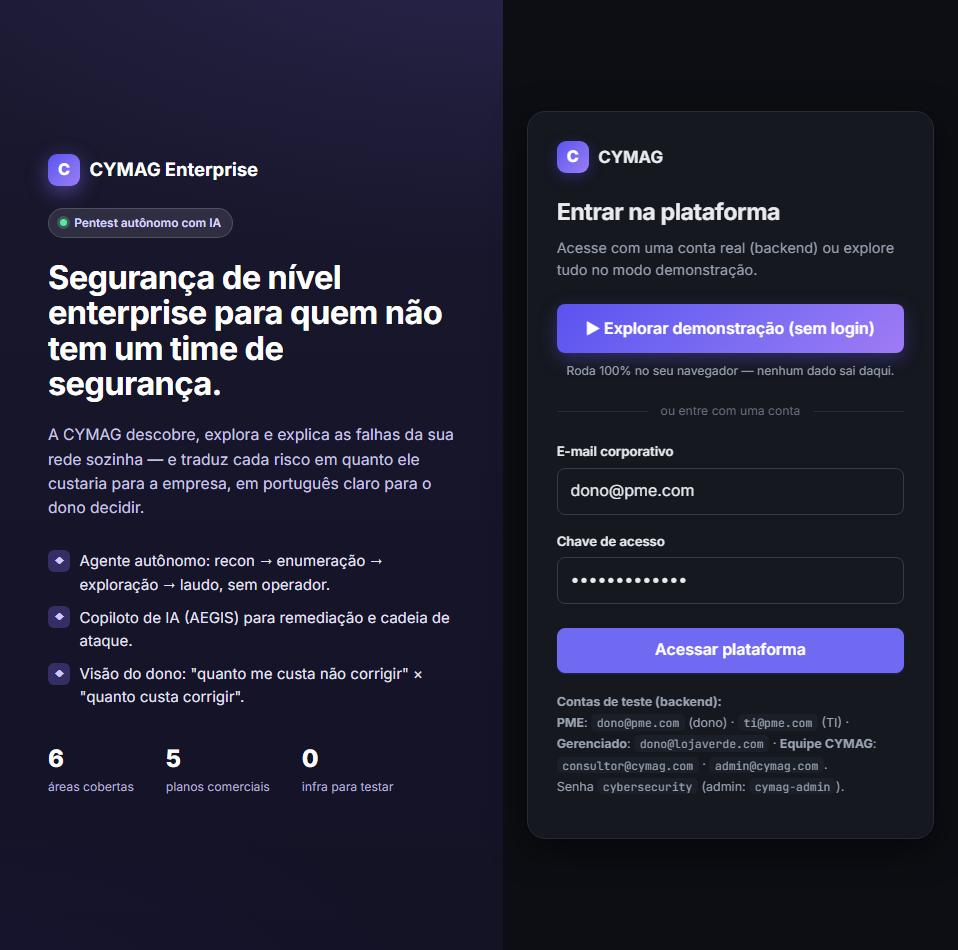
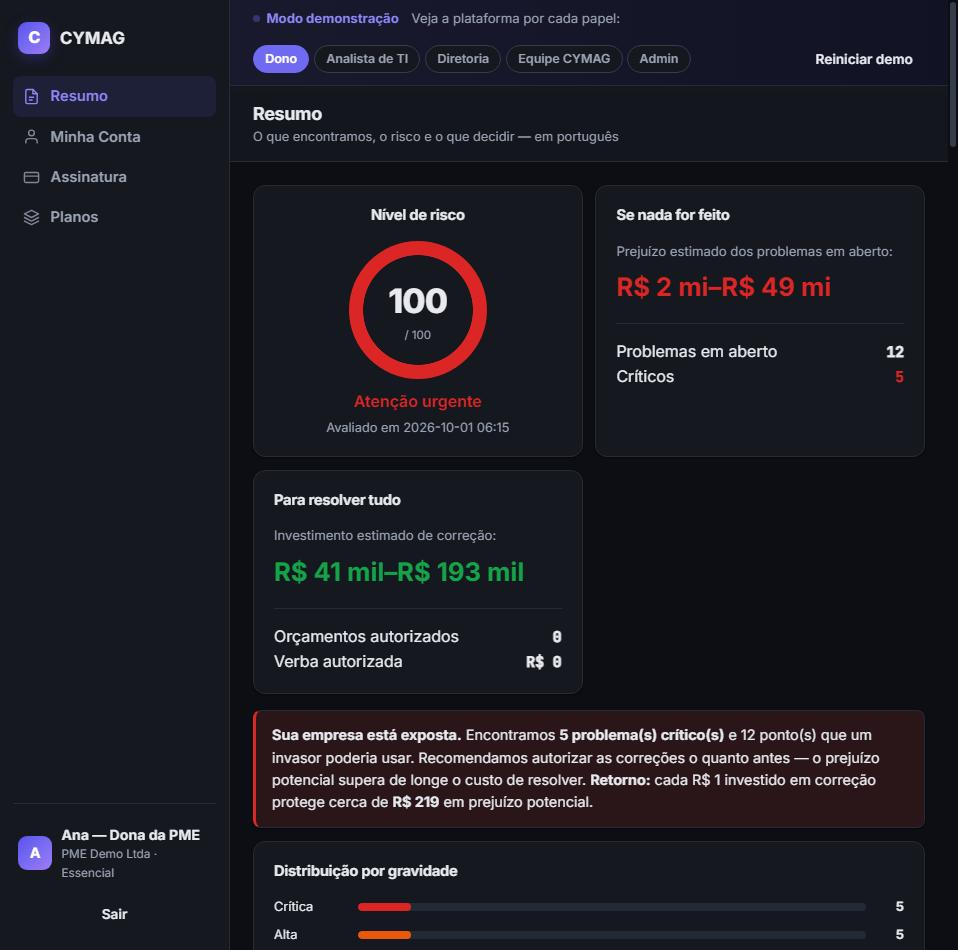
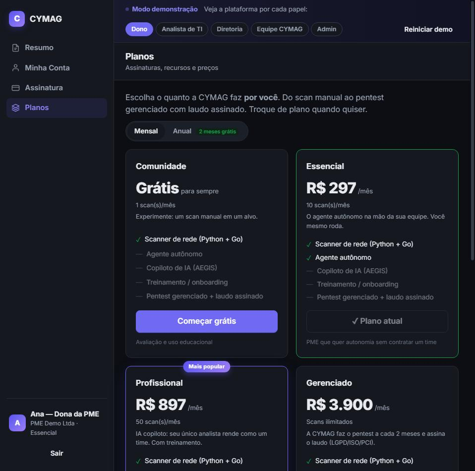
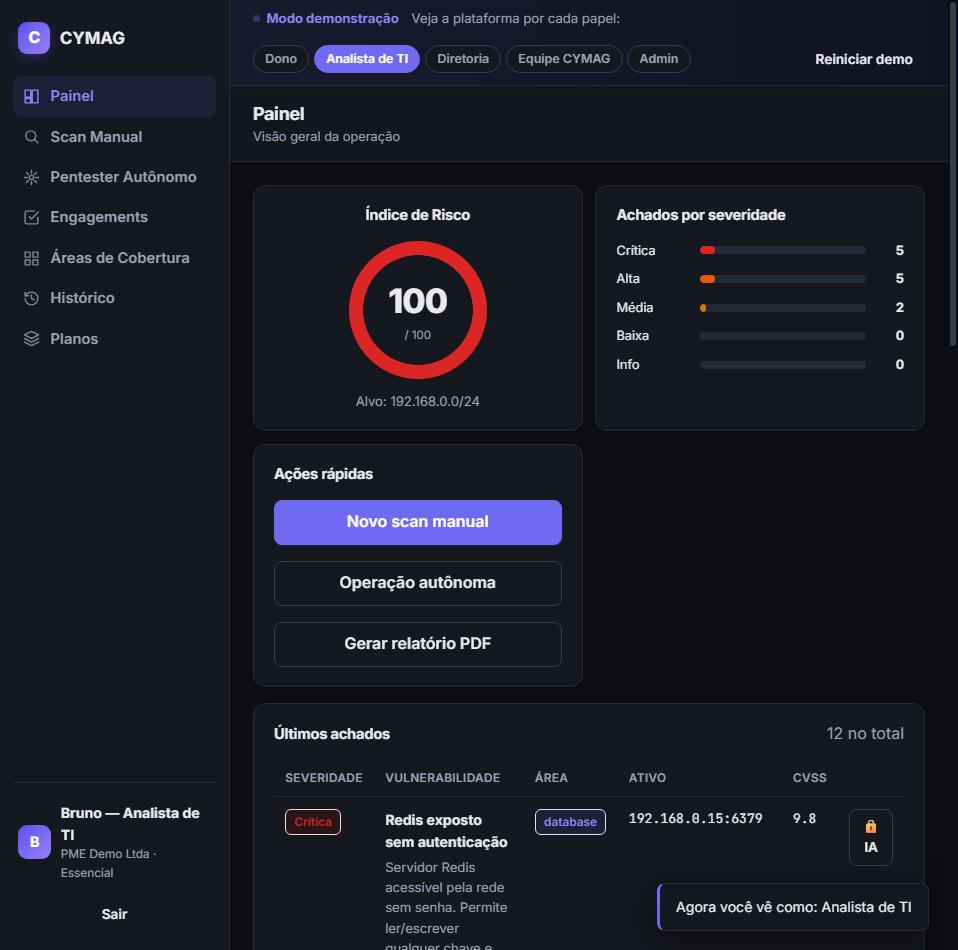

<div align="center">

# 🛡️ CYMAG Enterprise

### Pentest autônomo com IA que traduz falhas de segurança em **risco e custo para o dono do negócio**

Uma plataforma SaaS full-stack que descobre, explora e explica as vulnerabilidades
de uma rede — e responde à pergunta que o dono de uma PME realmente faz:
_"quanto me custa **não** corrigir isto?"_

[](https://www.python.org/)
[](https://flask.palletsprojects.com/)
[](https://go.dev/)
[](https://www.sqlite.org/)
[](tests/)

</div>

---

> 📖 **Novo por aqui?** Comece pelo **[PLATAFORMA.md](PLATAFORMA.md)** — guia
> completo do que é, como rodar e como funciona (inclui o novo painel de IA).

> 🤖 **Configurar a IA ficou fácil:** entre como **admin** → menu **IA / AEGIS** e
> cole qualquer chave de API (ex.: [Groq](https://console.groq.com/keys), gratuita).
> **Teste ao vivo** (latência, resposta, tokens) e **ative** o AEGIS na hora, sem
> editar arquivos nem reiniciar o servidor. Detalhes em [PLATAFORMA.md §5](PLATAFORMA.md#5--painel-de-ia-admin--configurar-e-testar-a-api).

---

## 🚀 Demonstração ao vivo

A plataforma inteira roda **100% no navegador**, com dados realistas e **sem precisar
de nenhum servidor no ar** — é só clicar em **"Explorar demonstração"**. Isso torna o
projeto gratuito de hospedar e instantâneo de testar.

- **GitHub Pages:** ative _Settings → Pages → Branch `main` / root_ e acesse
  `https://alefkaue.github.io/cymag_saas/`
- Na tela inicial, clique em **▶ Explorar demonstração (sem login)** e use a barra
  superior para ver a plataforma por cada **papel** (Dono, Analista de TI, Diretoria,
  Equipe CYMAG, Admin).

> O modo demonstração é implementado em `static/cymag-demo.js`: um "backend falso"
> client-side que responde às mesmas rotas da API real, com o mesmo formato. O resto
> do app não sabe a diferença — a mesma base de código roda com ou sem backend.

---

## 📸 Telas

| Landing + entrada | Resumo do dono (risco × custo) |
|---|---|
|  |  |

| Planos e assinatura | Console técnico (SecOps) |
|---|---|
|  |  |

---

## 💡 O problema que a CYMAG resolve

A maioria das PMEs **não tem (e não consegue manter) um time de segurança**. Elas têm,
no máximo, um profissional de TI sobrecarregado — e um dono que não entende de
cibersegurança, mas é quem aprova (ou não) a verba para corrigir os problemas.

A CYMAG ataca os dois lados:

1. **Para a equipe técnica** — um **agente autônomo** faz o trabalho pesado
   (reconhecimento → enumeração → exploração → laudo), para que uma pessoa só renda
   como um time. Um **copiloto de IA (AEGIS)** sugere remediação e planeja a cadeia de
   ataque.
2. **Para o dono** — uma visão de **negócio**, em português claro, que traduz cada
   falha em **"quanto custa se não corrigir"** × **"quanto custa corrigir"**, e deixa
   ele **autorizar o orçamento** de correção com um clique.

> 💰 **O diferencial:** a maioria dos scanners entrega uma lista de CVEs. A CYMAG
> entrega uma **decisão de negócio** — prejuízo estimado, custo de correção e retorno
> ("cada R$ 1 investido protege ~R$ X em prejuízo potencial").

---

## ✨ Funcionalidades

- 🔍 **Scanner de rede multicamada** — orquestrador com _fallback_ automático:
  binário **Go** (goroutines + banner grabbing) → **Nmap** → socket puro em Python.
  Funciona mesmo sem Nmap/Go instalados.
- 🤖 **Pentester autônomo** — operação em thread com _streaming_ de eventos ao vivo
  (recon → enum → exploit → plano de ataque), restrita ao **escopo autorizado**.
- 🧠 **AEGIS (copiloto de IA)** — integração com a Groq (LLM) **com fallback offline
  determinístico**: a plataforma nunca "quebra" sem a chave de API.
- 👔 **Visão do dono** — risco, distribuição por gravidade, **estimativa de prejuízo e
  de custo de correção por área**, ROI e **autorização de orçamento** (o "embargo
  financeiro") persistida por achado.
- 💳 **Planos e assinatura** — catálogo comercial (5 planos), _gating_ de features por
  plano (HTTP 402), quota de scans (HTTP 429), **troca de plano self-service** e um
  **checkout simulado** (mensal/anual, resumo do pedido, gestão da assinatura).
- 🔐 **Autorização ética (Engagements)** — toda varredura exige um contrato
  **autorizado por um admin** que contenha o alvo; hosts fora do escopo são
  descartados. Modelo RBAC com 5 papéis.
- 🧾 **Relatórios PDF** — laudo rápido e laudo executivo com narrativa gerada pela IA.
- 🛡️ **Segurança do próprio produto** — sessões assinadas, _password hashing_, trilha
  de auditoria e **sanitização anti prompt-injection** de tudo que vem do alvo antes
  de chegar ao LLM.

---

## 🏗️ Arquitetura

```
cymag_saas/
├── index.html                ← SPA (servida pelo Flask e como site estático)
├── run.py                    ← Entrypoint
├── app/                      ← Camada web (Flask), separada por área
│   ├── __init__.py           ← Application factory + registro de blueprints
│   ├── config.py             ← Configuração via ambiente/.env
│   ├── db.py                 ← Dados (SQLite stdlib: accounts/users/engagements/
│   │                            scans/findings/budget_decisions/audit)
│   ├── auth/                 ← Login, sessão, RBAC e gating por plano (decorators)
│   ├── scans/                ← Scan, remediação, cadeia, auto-descoberta, histórico
│   ├── autonomous/           ← Agente autônomo (runner em thread + polling)
│   ├── engagements/          ← Escopo autorizado (contrato ético do pentest)
│   ├── owner/                ← Visão de negócio do dono + decisões de orçamento
│   ├── billing/              ← Assinatura / troca de plano (self-service)
│   ├── reports/              ← Geração de PDF (fpdf2) + narrativa AEGIS
│   └── ai/aegis.py           ← Integração Groq + fallbacks offline + sanitização
├── core/                     ← Motor de domínio (agnóstico de framework, testável)
│   ├── scanner.py            ← Orquestrador (FallbackChain em todas as fases)
│   ├── exploit_engine.py     ← Checks por serviço (HTTP, MQTT, Redis, SMB, MySQL…)
│   ├── checks/               ← Checks plugáveis por área (registry + decorators)
│   ├── business.py           ← Tradução "técnico → negócio" (custo das falhas)
│   ├── plans.py              ← Catálogo de planos e regras de entitlement
│   └── severity.py           ← Modelo único de severidade e cálculo de risco
├── scanner_go/               ← Port scanner opcional em Go (opcional; há fallback)
├── static/                   ← Front-end (SPA sem framework)
│   ├── cymag.css             ← Design system (light/dark, responsivo)
│   ├── cymag.js              ← SPA conectada a toda a API
│   └── cymag-demo.js         ← Backend falso client-side (modo demonstração)
└── tests/                    ← Suíte pytest (lógica de negócio, planos, billing, escopo)
```

**Princípios de design do código:** separação `core/` (domínio puro) × `app/`
(web); _fonte única_ para severidade e planos; _fallbacks_ em cada camada para
degradar com elegância (sem Go, sem Nmap, sem IA — tudo continua funcionando).

---

## 🧰 Stack

**Back-end:** Python 3.10+ · Flask 3 · SQLite (stdlib, sem ORM) · fpdf2 · Groq (LLM) ·
Go (scanner opcional) · pytest
**Front-end:** HTML + CSS + JavaScript _vanilla_ (SPA sem framework, design system
próprio com dark mode)

---

## ▶️ Como rodar

### Opção 1 — Demonstração (sem instalar nada)
Abra o `index.html` no navegador **ou** hospede o repositório no GitHub Pages e clique
em **"Explorar demonstração"**. Tudo roda client-side.

### Opção 2 — Full-stack (backend real)

```bash
# 1. Ambiente virtual
python -m venv venv
# Linux/macOS: source venv/bin/activate   |   Windows: .\venv\Scripts\Activate.ps1

# 2. Dependências (as 4 primeiras são obrigatórias; o resto habilita extras)
pip install flask groq requests fpdf2 python-dotenv
pip install psutil python-nmap paho-mqtt pymysql   # opcionais (há fallback)

# 3. Rodar
python run.py            # http://127.0.0.1:5000
```

Sem `GROQ_API_KEY`, o AEGIS roda em **modo offline** (respostas determinísticas).
Veja `INSTALL.md` para detalhes e variáveis de ambiente.

**Contas de teste:** `dono@pme.com` (dono) · `ti@pme.com` (TI) ·
`dono@lojaverde.com` (plano gerenciado) · `consultor@cymag.com` / `admin@cymag.com`
(equipe). Senha `cybersecurity` (admin: `cymag-admin`).

### Testes
```bash
pytest -q        # 49 testes
```

---

## 🔒 Ética e escopo

A CYMAG foi desenhada como ferramenta de **segurança defensiva e pentest autorizado**:
nenhuma varredura ocorre sem um **Engagement autorizado** que contenha o alvo, e o
escopo é aplicado em todas as fases. Use apenas em redes e sistemas que você tem
permissão explícita para testar.

---

<div align="center">

Projeto de portfólio — desenvolvido por **[@CymagCyber
](https://github.com/CymagCyber)**.
As estimativas de valor em reais são de ordem de grandeza, para priorização, e não
constituem perícia contábil.

</div>
